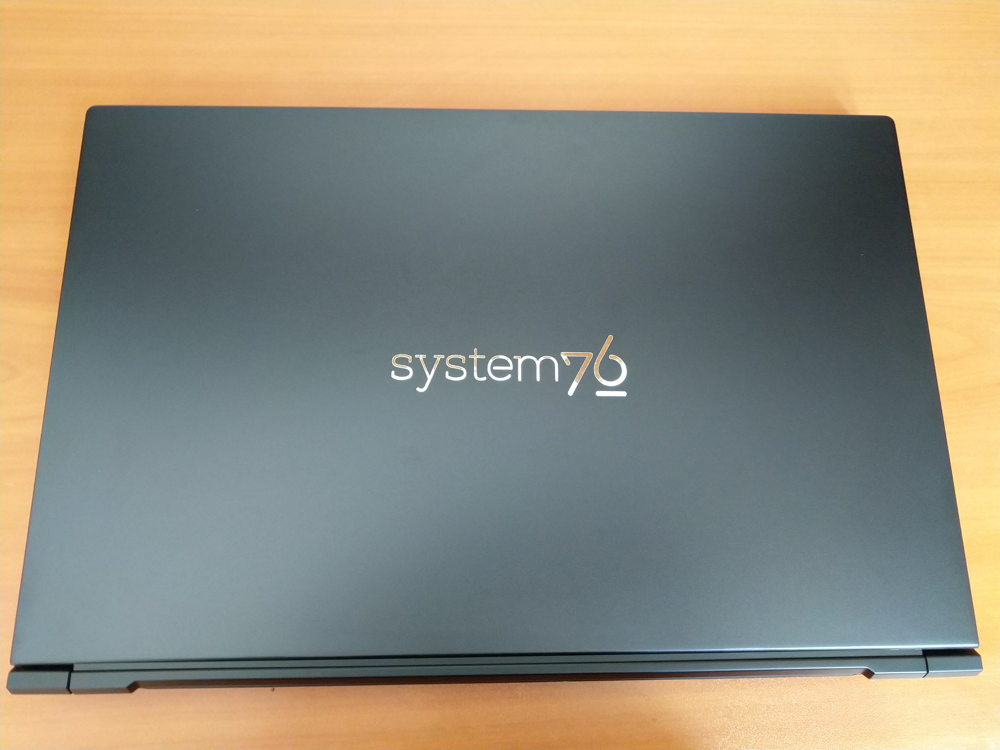
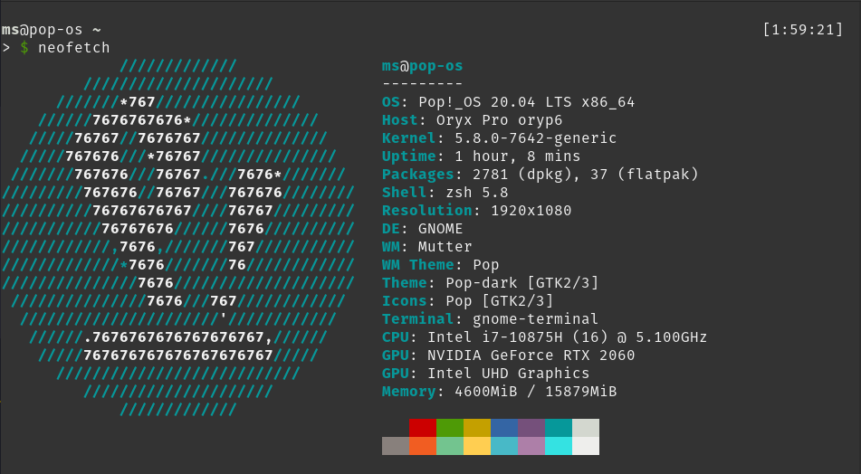
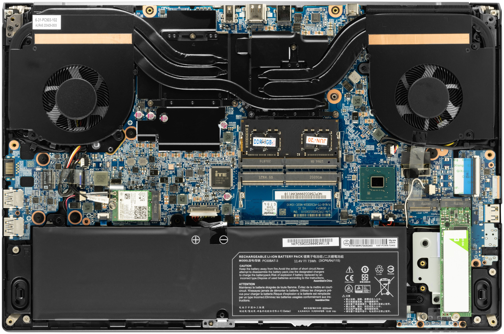
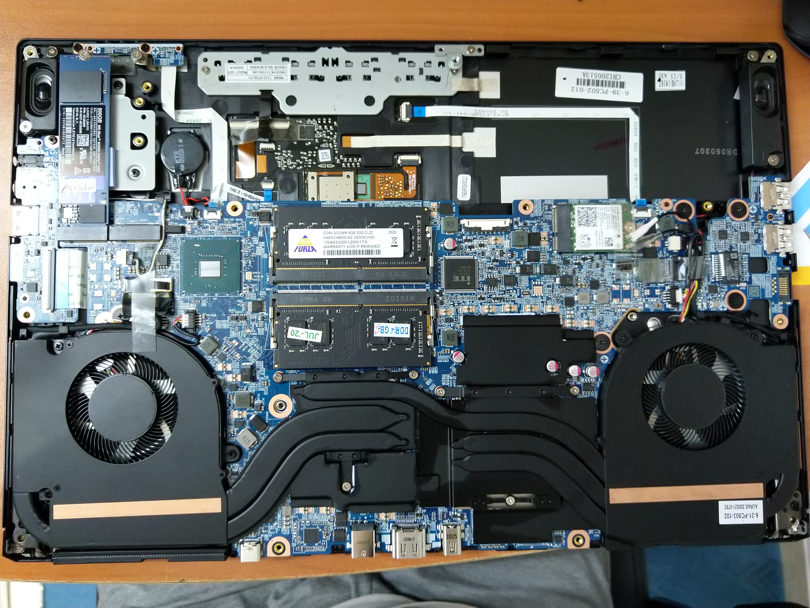

# Intro

There are many articles about how good or how bad System76 devices are, many reddit posts about how they are a re-branded clevo laptop and if that is good or evil and I will certainly leave that decision up to you! In this post I'll try to write about the things I love and hate about Oryx pro. And before you ask, YES there are things I wish I could change about this amazing laptop. Now let's jump right into it.



# How did I get one?

Many articles begin by saying how good something is until you reach the end and find out that it literally costs an arm and a leg, and all your dreams of buying it stay the same, a dream! Giving you a heads up, Oryx pro does cost an arm and a leg specially if you are not inside the United States. It cost me about 2500$, but is it worth all that money?

Price is one of the main factors when deciding to buy something and since I live in Iran where _403 forbidden_ error code is THE most common due to sanctions that the useless leaders of the free(!) world have put on us, buying one of these was truely hard.

# Specification



The model I purchased is the most basic but has 16GB of RAM instead of 8GB, and has 500GB of NVME storage instead of 250GB, and to be honest I regret both of them, since I could buy them seperately at a lower cost and avoid paying tax! Now here comes the interesting part: System76 respects your **right to repair** and you can easily open up your laptop to modify or even repair your laptop on your own. They have documented all the steps required to do certain things without the risk of voiding the guarantee of your device. You can find a list of documents [here](https://support.system76.com/articles/service-manuals/). You can see the interior below.


official image with battery


image taken by me with battery removed

# Touchpad and Keyboard

In my opinion one of the strongest points about Oryx pro is the keyboard. Typing on this device is never boring and since there are lots of space between keys you won't encounter misclicks that often. One problem that I'm having with my device is that usually the keyboard is not responsive at all while the system is booting up and I have to wait about half a minute before I can start entering my password. I think this is more of a firmware issue rather than a hardware issue. Touchpad is the most frictionless I have ever touched and there is nothing more to say about that.

## Keyboard changes

There are a few changes that if made, would improve the work performance drastically:

1. Caps lock and Num lock definitely need indicators. Right now there is no way of telling if the Caps lock is on or not without typing wich is unacceptable.

That's it? actually no. There is one more issue that I'd rather not exist but I guess this issue is more about me being sensitive than normal and the issue is that there are hollow areas between keyboard and the motherboard wich causes the keyboard to go slightly down. This is not sensible at all unless you are watching your fingers while typing, like me! for example pressing the keys **_O_** or **_P_** causes all the surrounding keys to move down ever so slightly but pressing a key like **_S_** doesn't.

## Keyboard lighting

One the interesting parts of the keyboard is the backlit wich can be toggled on and off but what is interesting about this is that since it can change color to the three basic colors (RGB) in theory it should be able to support all colors e.g. color Orange (#FF5500) can be forced upon the keyboard using this code in _Pop!\_OS 20.04_:

```bash
$ echo FF5500 | sudo tee /sys/class/leds/system76_acpi::kbd_backlight/color
```

# Summary

In this post I tried to write about all the things that I always wanted to talk about and some of the things I wish someone had told me before I buy my laptop. I will publish more episodes of this series soon, so stay tuned and thank you for reading.
